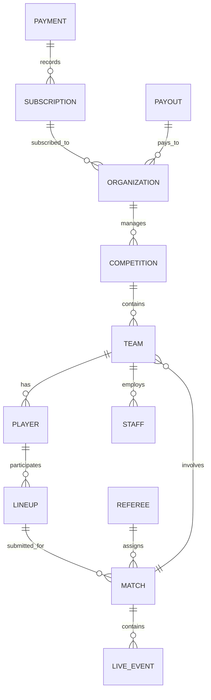

# Pitch Perfect Pro - Complete Business Logic Documentation

## Table of Contents

1. [System Overview](#system-overview)
2. [Module Business Logic](#module-business-logic)
3. [Entity Relationships](#entity-relationships)
4. [Business Rules & Workflows](#business-rules--workflows)

---

## System Overview

**Application Name:** Pitch Perfect Pro  
**Purpose:** Comprehensive football/soccer league management platform  
**Primary Users:** Platform Owners, Event Organizers, Clubs, Coaches, Players  
**Architecture:** Role-based multi-tenant system

### Core Architecture
- **Multi-role system** with RBAC (Role-Based Access Control)
- **Hierarchical organization:** Federation → Region → League → Club
- **Competition management** with multiple formats (League, Knockout, Group+KO)
- **Match lifecycle management** from scheduling to analytics
- **Financial management** with payments, subscriptions, and compliance

---

## Module Business Logic

### 1. OWNER MODULE (Platform Administration)

**Purpose:** Global platform administration and monitoring

#### 1.1 Platform Dashboard
- **Displays:**
  - Total users, organizations, competitions, clubs, matches
  - System health metrics, revenue trends
  - Real-time activity monitoring
- **Business Logic:**
  - Aggregates data across all tenants
  - Calculates platform-wide KPIs
  - Monitors system performance in real-time
  - Tracks platform growth metrics

#### 1.2 User Management
- **Responsibilities:**
  - Register/verify/suspend users
  - Assign roles (Owner, Admin, EO, Club, Coach, Player)
  - Manage user subscriptions
  - Audit user activities
- **Business Rules:**
  - Each user requires KYC verification
  - Roles determine access levels and feature availability
  - Suspended users cannot access platform
  - Admin role inherits Owner permissions

#### 1.3 Platform Management
- **Configuration:** Settings for platform-wide features
- **Branding:** Logo, colors, terminology customization
- **Features:** Enable/disable features per tenant
- **Integrations:** Third-party API management
- **Business Logic:**
  - Feature flags control availability
  - Branding customizes user experience per region
  - Integrations managed centrally

#### 1.4 Organization Management
- **Types:** Clubs, Event Organizers, Leagues, Federations
- **Registration Flow:**
  1. Application submitted
  2. Document verification
  3. Approval/rejection
  4. Account activation
- **Business Rules:**
  - Only verified organizations can create competitions
  - Event Organizers must be licensed by governing bodies
  - Clubs require federation membership

#### 1.5 Competition Monitoring
- **Tracks:**
  - Active/completed competitions
  - Match status and results
  - Participant registration
  - Schedule adherence
- **Business Logic:**
  - Automatically tracks competition progress
  - Flags schedule delays
  - Monitors registration deadlines

#### 1.6 Finance Management
- **Tracks:**
  - Revenue (subscriptions, transaction fees)
  - Expenses (infrastructure, support)
  - Reconciliation across payment gateways
  - Payouts to organizations
- **Business Rules:**
  - Platform takes transaction fee percentage
  - Minimum payout threshold
  - Automatic settlement schedules
  - Compliance with financial regulations

#### 1.7 Infrastructure Monitoring
- **Monitors:**
  - Server health and uptime
  - API performance (latency, throughput)
  - Database health
  - Background job processing
  - Storage utilization
- **Alert Thresholds:**
  - Server uptime < 99.9% → Alert
  - API latency > 500ms → Warning
  - Database latency > 100ms → Alert
  - Job failure rate > 5% → Alert

#### 1.8 Security & Compliance
- **KYC Verification:** User identity verification
- **AML Screening:** Anti-money laundering checks
- **PCI DSS:** Payment card industry compliance
- **Data Residency:** Ensure data stored in jurisdiction
- **Audit Logging:** Track all system actions
- **Business Rules:**
  - All transactions logged with timestamp
  - Financial compliance checked monthly
  - Security audit annually

---

### 2. ORGANIZATION MODULE

**Purpose:** Manage organizational hierarchies and registries

#### 2.1 Club Registry
- **Club Information:**
  - Name, location, contact details
  - Logo, colors, stadium info
  - Management structure
  - Membership count
- **Club Status:** Verified, Pending, Suspended, Inactive
- **Business Rules:**
  - Each club has unique ID
  - Club can participate in multiple leagues
  - Club must have head coach before registration
  - Club requires league membership

#### 2.2 Federation Structure
- **Hierarchy:** Federation → Region → League → Club
- **Federation (1)** → Multiple Regions → Multiple Leagues → Multiple Clubs
- **Business Logic:**
  - Automatic hierarchy maintenance
  - Power rolls down (Federation → Region → League → Club)
  - Restrictions filter by hierarchy level
- **Data Aggregation:**
  - Total clubs per region
  - Leagues per region
  - Players per club

#### 2.3 League Organization
- **League Information:**
  - Name, season, region
  - Club count, format (League/Knockout)
  - Start/end dates
  - Status (Planning, Active, Completed)
- **Business Rules:**
  - League must have minimum 4 teams
  - Season unique per league
  - Cannot modify teams after competition starts
  - Fixture schedule auto-generated

#### 2.4 Event Organizer Registry
- **EO Information:**
  - Organization details, license info
  - Competitions managed
  - Payment account details
- **Status Workflow:**
  - Application → License Verification → Approval → Active
- **Business Rules:**
  - EO requires valid license
  - EO can manage multiple competitions
  - Insurance required before events

---

### 3. COMPETITION MODULE

**Purpose:** Manage competition lifecycle from creation to completion

#### 3.1 Competition Creation Wizard
- **Steps:**
  1. **Competition Info:** Name, season, format, category
  2. **Categories:** Age groups, gender divisions
  3. **Age Groups:** U-12, U-14, U-16, U-18, Senior
  4. **Season:** Start/end dates, schedule
  5. **Confirmation:** Review and submit
- **Business Logic:**
  - Multi-step validation
  - Template selection for format
  - Automatic fee calculation based on parameters
  - Constraints:
    - min 4 teams required
    - Season must not overlap existing
    - Start date must be future date

#### 3.2 Fixture Generator
- **Algorithms:**
  - **League Format:** Round-robin, Double round-robin
  - **Knockout Format:** Single/double elimination
  - **Group+KO:** Group stage → Knockout stage
- **Business Rules:**
  - Fixtures generated after team registration closes
  - Cannot edit fixtures after matches started
  - Automatic rescheduling on conflict
  - Venue reservation checked
  - Team availability verified

#### 3.3 Match Management
- **Match Lifecycle:**
  1. **Scheduled** → Referee assigned → Lineup submitted → **Live** → **Finished** → **Analyzed**
- **Match Data:**
  - Home/Away teams, kickoff time
  - Venue, referee, lineups
  - Final score, statistics
  - Cards, suspensions
- **Business Rules:**
  - Match can only be created within competition dates
  - Both teams must be registered
  - Venue must have capacity for expected attendance
  - Referee must be available

#### 3.4 Team Slot Management
- **Slot Types:**
  - Total slots per category
  - Filled slots (teams registered)
  - Available slots
- **Business Logic:**
  - Allocate slots per age category
  - Track registration progress
  - Auto-close category when full
  - Hold slots for late registrations
- **Rules:**
  - Registration deadline before competition start
  - Refund policy for cancelled registrations

#### 3.5 Standing Calculation
- **Points System:**
  - Win: 3 points
  - Draw: 1 point
  - Loss: 0 points
- **Ranking Criteria:**
  1. Total points (descending)
  2. Goal difference (descending)
  3. Goals for (descending)
  4. Head-to-head record
  5. Fair play rating
- **Real-time Updates:**
  - Recalculate after each match
  - Automatic history tracking
  - Promotion/relegation eligibility

---

### 4. MATCH MODULE

**Purpose:** Full match lifecycle management

#### 4.1 Match Scheduler
- **Scheduling Logic:**
  - Check team availability
  - Check referee availability
  - Check venue availability
  - Check no fixture congestion (max matches/week)
  - Prefer evening slots (19:00)
- **Business Rules:**
  - Min 5 day gap between consecutive matches
  - Max 3 matches same team in 10 days
  - Matches scheduled at approved venues
  - Minimum 48 hours notice required

#### 4.2 Referee Assignment
- **Assignment Criteria:**
  - Referee certification level matches competition tier
  - Referee availability confirmed
  - No conflict of interest (referee's team playing)
  - Fairness: balance workload across referees
- **Referee Levels:**
  - AFC Pro: International matches
  - AFC A: National/Regional matches
  - AFC B: Regional/Local matches
  - Local: Youth/amateur matches
- **Business Logic:**
  - Auto-suggest referees based on:
    - Availability
    - Location proximity
    - Experience level
    - Recent assignments
  - Manual override available for special cases

#### 4.3 Lineup Management
- **Lineup Submission:**
  - Allows coaches to submit 11 starting + substitutes
  - Validates player eligibility
  - Checks available players (not suspended/injured)
  - Confirms formation (e.g., 4-3-3, 4-2-3-1)
- **Business Rules:**
  - Lineup submitted min 24 hours before match
  - Players suspended cannot be included
  - Injured players flagged as unavailable
  - Formation must match team's registered formations
  - Max 23 players submitted (11+12)

#### 4.4 Live Events Tracking
- **Event Types:**
  - Goal (scorer, assist, time)
  - Card (type, player, reason)
  - Substitution (in/out, time)
  - Injury (player, time)
- **Business Logic:**
  - Real-time event recording
  - Automatic statistics calculation
  - Suspension tracking (2 yellow = 1 red)
  - Goal differential updates standings
  - Match timeline generated

#### 4.5 Match Statistics
- **Team Statistics:**
  - Possession %, Shots, Shots on Target
  - Passes, Pass accuracy
  - Tackles, Fouls, Corners
  - Cards (Yellow/Red)
- **Player Statistics:**
  - Rating, Minutes played
  - Shots, Goals, Assists
  - Tackles, Passes, Accuracy
  - Cards received
- **Calculation Logic:**
  - Automated after match end
  - Aggregated for season stats
  - Fed into advanced analytics

#### 4.6 Tactical Analysis
- **Formation Analysis:**
  - Team formation used
  - Formation effectiveness against opponent
  - Player positioning heatmaps
- **Performance Metrics:**
  - Possession dominance analysis
  - Attack efficiency (shots:goals ratio)
  - Defense solidity (shots conceded:goals)
  - Momentum shifts (quarter-by-quarter)
- **Recommendations:**
  - Formation adjustments
  - Player rotation suggestions
  - Set piece improvements

---

### 5. FINANCE MODULE

**Purpose:** Subscription, payments, payouts, and compliance management

#### 5.1 Subscription Plans
- **Plan Types:**
  - **Basic:** 5 players, basic reports, email support
  - **Professional:** 20 players, advanced reports, priority support, API
  - **Enterprise:** Unlimited, custom features, dedicated support
- **Billing Models:**
  - Monthly, Quarterly, Annual
  - Auto-renewal with cancellation option
  - Proration for upgrades/downgrades
- **Business Rules:**
  - Free trial period (7 days) for new organizations
  - No downgrade mid-billing period
  - Upgrade effective immediately with proration
  - Cancellation effective end of billing period

#### 5.2 Payment Gateway Integration
- **Supported Methods:**
  - Bank Transfer (BCA, Mandiri, BNI Virtual Accounts)
  - Credit Cards (Visa, Mastercard via Stripe)
  - E-Wallets (GCash, OVO, DANA)
  - Online Banking
- **Transaction Flow:**
  1. Create invoice
  2. Customer selects payment method
  3. Process payment
  4. Verify payment receipt
  5. Activate service / Credit account
- **Business Rules:**
  - Transaction fees vary by method (0.5%-2.9%)
  - Minimum payment amount
  - Automatic retry for failed payments (3 attempts)
  - Reconciliation daily

#### 5.3 Payout Requests
- **Workflow:**
  1. Organization submits payout request with:
     - Amount
     - Bank details
     - Purpose
  2. Finance team reviews (AML check)
  3. Approval/Rejection
  4. Scheduled for settlement
  5. Wire transfer executed
- **Business Rules:**
  - Minimum payout amount (e.g., 100K)
  - Maximum 2 payouts per week
  - Settlement within 5 business days
  - Fees charged for wire transfer
  - AML verification required

#### 5.4 Transaction Monitoring
- **Monitoring Metrics:**
  - Transaction amount, frequency
  - Unusual patterns (spike detection)
  - Geographic anomalies
  - High-risk transactions
- **Risk Scoring:**
  - Auto-flag transactions with risk score > 15%
  - Manual review required for > 50% risk
  - Auto-block for > 90% risk
- **Business Rules:**
  - Large transactions (> 50M) require manual review
  - Daily limit per account
  - Velocity checks (max per time period)

#### 5.5 Financial Compliance
- **Compliance Requirements:**
  - KYC (Know Your Customer) verification
  - AML (Anti-Money Laundering) screening
  - PCI DSS (Payment Card Industry Data Security)
  - GDPR (Data protection)
  - Fatca (Foreign Account Tax Compliance)
- **Business Rules:**
  - All users require KYC before first transaction
  - Screening checked against OFAC list
  - Compliance audit monthly
  - Breach notification within 72 hours
  - Compliance score maintained > 80%

---

### 6. ANALYTICS MODULE

**Purpose:** Performance analysis across competitions, teams, and players

#### 6.1 League Standings
- **Calculation:**
  - Points = (Wins × 3) + (Draws × 1)
  - Ranking by: Points → Goal Difference → Goals For → Head-to-head
- **Updates:**
  - Real-time after match completion
  - Historical tracking (snapshot after each matchday)
  - Automatic promotion/relegation determination
- **Features:**
  - Team form (last 5 matches)
  - Trend analysis (↑ ↓ →)
  - Projection to final standings

#### 6.2 Team Performance Overview
- **Metrics Tracked:**
  - Win/Draw/Loss record
  - Points total
  - Goals For / Goals Against
  - Goal Difference
  - Win % efficiency
  - Home/Away performance split
- **Trend Analysis:**
  - Weekly performance breakdown
  - Form indicators (W-W-L-D-W)
  - Momentum trends
- **Business Logic:**
  - Aggregates from all matches
  - Compares to league average
  - Projects final position

#### 6.3 Top Scorers
- **Ranking Criteria:**
  1. Goals scored (descending)
  2. Efficiency (goals:shots)
  3. Assists
  4. Minutes played
- **Features:**
  - Goal streaks
  - Home vs Away goals split
  - Penalty vs Open play goals
- **Updates:** Real-time after each match

#### 6.4 Match Result Trends
- **Tracks:**
  - Win/Draw/Loss pattern over time
  - Goal scoring trends (ascending/stable/declining)
  - Defense performance (goals conceded pattern)
  - Head-to-head historical records
- **Analytics:**
  - Form indicator (current form)
  - Momentum shifts
  - Prediction for next matches
- **Business Logic:**
  - Rolling averages (5-match window)
  - Trend direction (↑ ↑ → ↓ ↓)
  - Consistency score

---

### 7. ADMIN MODULE

**Purpose:** Technical administration and compliance management

#### 7.1 System Monitoring
- **Metrics Monitored:**
  - Server uptime (target: 99.99%)
  - API response time (target: < 100ms)
  - Database health (latency < 50ms)
  - Background job processing
  - Storage utilization
- **Alert Rules:**
  - Uptime < 99.9% → Critical
  - API latency > 500ms → Warning
  - DB latency > 100ms → Alert
  - Job queue > 10k items → Warning
  - Storage > 80% → Alert
- **Actions:**
  - Auto-scaling when under load
  - Circuit breaker for failing services
  - Alert notifications to ops team

#### 7.2 API Key Management
- **API Key Features:**
  - Renewable keys with rotation
  - Scopes (read:*, write:*, etc.)
  - Rate limiting per key
  - Usage tracking
  - Expiration dates
- **Business Rules:**
  - Keys expire after rotation (default 90 days)
  - Minimum permission principle (least privilege)
  - Usage cap per key (e.g., 1M requests/month)
  - Revocation immediate on security concern

#### 7.3 Compliance Dashboard
- **Compliance Frameworks Tracked:**
  - GDPR (EU data protection)
  - CCPA (California privacy)
  - ISO 27001 (Information security)
  - SOC 2 (Service organization control)
  - Local regulations (per jurisdiction)
- **Audit Process:**
  - Automated checks for compliance rules
  - Manual verification annually
  - Evidence collection and storage
  - Non-compliance remediation tracking
- **Business Rules:**
  - Compliance score must stay > 85%
  - Annual third-party audit required
  - Incidents documented and tracked

---

### 8. EVENT ORGANIZER (EO) MODULE

**Purpose:** Competition management for event organizers

#### 8.1 EO Overview Dashboard
- **Displays:**
  - Active competitions count
  - Pending registrations
  - Matches today/tomorrow
  - Revenue this month
  - Recent activities
- **Quick Actions:**
  - Create new competition
  - Approve registrations
  - Schedule matches
  - Generate reports
- **Business Logic:**
  - Aggregates EO's competitions data
  - Shows pending actions requiring attention

#### 8.2 Competitions Management
- **Displays:**
  - List of EO's competitions
  - Status (Draft, Active, Completed)
  - Format (League, Knockout, Group+KO)
  - Participating clubs count
  - Progress indicator
- **Actions:**
  - Create new competition
  - Edit competition details
  - View standings/schedule
  - Manage registrations
  - Generate certificates/reports

#### 8.3 Club Registration Management
- **Registration Workflow:**
  1. Club applies to competition
  2. Submits required documents
  3. EO reviews registration
  4. Approval/Rejection decision
  5. Confirmation to club
- **Business Rules:**
  - Registration deadline enforced
  - Duplicate team (same club) prevented in division
  - Team fee payment required
  - Minimum squad confirmed (e.g., 14 players)

#### 8.4 Schedule Management
- **Features:**
  - Week-by-week view
  - Drag-to-reschedule capability
  - Conflict detection
  - Coach preference accommodation
- **Business Rules:**
  - Matches cannot be changed < 48 hours before
  - Weather/venue cancellations allowed
  - Must maintain competition schedule
  - Rescheduled matches within same season

#### 8.5 Standings Management
- **Auto-Calculation:**
  - Real-time updates after each match
  - Points awarded correctly
  - Ranking criteria applied
- **Manual Override:**
  - Deduction for misconduct
  - Point adjustments for invalid results
  - Reversal capability with audit log

---

### 9. CLUB MODULE

**Purpose:** Internal club management

#### 9.1 Club Dashboard
- **Overview:**
  - Team stats (wins, draws, losses, points)
  - Upcoming matches
  - Recent results
  - Squad count, staff count
  - Financial status
- **Quick Info:**
  - League position
  - Current form
  - Upcoming fixtures (next 3)
  - Performance trends

#### 9.2 Squad Management
- **Player Information:**
  - Name, number, position, age
  - Nationality, height, weight
  - Contract status (active, loan, expiring)
  - Injury status
  - Eligibility (registration, suspension)
- **Actions:**
  - Add/edit/remove players
  - Assign positions
  - Set shirt numbers
  - Update contract info
- **Business Rules:**
  - Each player has unique squad number (1-99)
  - Squad must have 14+ players for competition
  - Foreign player quota may apply
  - Min age requirements per category

#### 9.3 Staff Management
- **Staff Types:**
  - Head Coach
  - Assistant Coaches
  - Medical Staff
  - Fitness Coach
  - Goalkeeping Coach
  - Physiotherapist
- **Staff Information:**
  - Qualifications, certifications
  - Experience, coaching history
  - Contact details
  - License status/expiration
- **Business Rules:**
  - Head coach required before club registration
  - Licenses must be current
  - Background checks required
  - Insurance coverage verified

#### 9.4 Youth Academy
- **Youth Teams by Age Category:**
  - U-12, U-14, U-16, U-18
- **Tracking:**
  - Players per category
  - Coaches assigned
  - Training schedule
  - Progression to senior team
- **Business Logic:**
  - Development pathway management
  - Elite talent identification
  - Monitoring progress metrics

#### 9.5 Club Finance
- **Revenue Tracking:**
  - Ticket sales, Sponsorships
  - Merchandise sales
  - Broadcasting rights
  - Grant/subsidies
- **Expense Tracking:**
  - Player salaries
  - Staff compensation
  - Operations & maintenance
  - Travel, medical, equipment
- **Key Metrics:**
  - Net profit/loss
  - Budget variance
  - Cash position
  - Revenue growth trends
- **Business Rules:**
  - Budget approval required before spending
  - All expenses require documentation
  - Monthly reconciliation required
  - Annual audit required

---

### 10. SOCCEROS MODULE (Role-Based Dashboards)

**Purpose:** Specialized dashboards for different user roles

#### 10.1 Socceros Dashboard Structure
- **Role-Specific Layouts:**
  - Owner Dashboard: Platform metrics, global analytics
  - EO Dashboard: Competition management, revenue
  - Club Dashboard: Team stats, match results
  - Coach Dashboard: Squad management, tactics
  - Player Dashboard: Personal performance, match schedules
- **Common Components:**
  - Header with role badge
  - Statistics cards (KPIs)
  - Recent activities feed
  - Upcoming actions/deadlines
  - Quick action buttons

#### 10.2 Permissions by Role
- **Owner:** Full system access, all organization data
- **EO:** Competition management, team registrations
- **Club:** Squad, staff, matches, finances
- **Coach:** Squad, tactics, match preparation
- **Player:** Personal profile, match schedules, statistics

---

## Entity Relationships



---

## Business Rules & Workflows

### Key Business Rules

1. **User Registration:**
   - KYC verification mandatory
   - Email verification required
   - Phone optional but recommended
   - Password complexity: min 8 chars, upper, lower, number, special

2. **Organization Hierarchy:**
   - Federation (1) → Regions (many) → Leagues (many) → Clubs (many)
   - Each level has specific permissions
   - Restrictions propagate down hierarchy

3. **Competition Lifecycle:**
   - Draft → Registration → Fixture Generation → Live → Completed
   - Can only revert where specified
   - Key dates locked once started

4. **Match Constraints:**
   - Team must be registered in competition
   - Venue must be confirmed
   - Referee must be assigned
   - Min 24-hour notice before match
   - Cannot play duplicate matchups (same date, same venue)

5. **Player Eligibility:**
   - Must be registered with club
   - Must not be suspended
   - Must meet age requirements for category
   - Contract must be active

6. **Financial Rules:**
   - Transaction fee: 2.5% of amount
   - Minimum payout: 100K
   - Settlement window: 5 business days
   - AML check required for all transactions > 50M

7. **Standing Calculation:**
   - Points: Win=3, Draw=1, Loss=0
   - Tiebreaker: Points → GD → GF → H2H → Fair Play
   - Real-time recalculation after match ends

### Critical Workflows

#### 1. Club Registration for Competition
```
1. Club submits registration
2. System validates:
   - Club active and verified
   - Min squad size (14 players)
   - Registration fee paid
   - No duplicate entry
3. EO reviews documentation
4. Either Approved or Rejected
5. If Approved: Team slot allocated, schedule generation queued
6. Notification sent to club
```

#### 2. Match Execution Flow
```
1. Match scheduled (T-7 days)
2. Referee assigned (T-5 days)
3. Both teams submit lineups (T-1 day)
4. Match day:
   - Pre-match verification
   - Coin toss assets determined
   - Match begins
5. Live event recording
6. Match concludes
7. Statistics finalized
8. Standings updated
9. Reports generated
10. Coaches can request review (within 24h)
```

#### 3. Payment Collection Workflow
```
1. Invoice generated (subscription/entry fee)
2. Payment link sent to customer
3. Customer selects payment method
4. Payment processed
5. Receipt recorded
6. Automatic retry if failed (max 3 attempts)
7. On success:
   - Service activated/renewed
   - Receipt emailed
   - Accounting logged
   - Invoice marked paid
```

---

## Conclusion

This documentation provides a comprehensive overview of the Pitch Perfect Pro application's business logic across all modules. Each module operates with specific business rules, workflows, and constraints that ensure data integrity, fair competition, and financial compliance.

The system follows a hierarchical structure with clear role-based permissions, enabling each stakeholder (platform owner, organizations, clubs, teams, players) to manage their respective domains efficiently while maintaining system-wide consistency and compliance.
